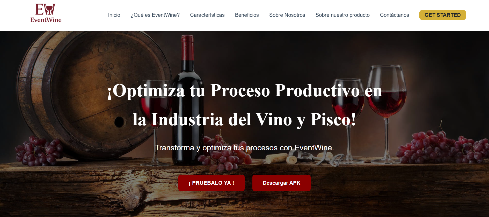

# 🷠EventWine - Landing Page | [](https://github.com/EventWine/EventWine-Landing-Page/commits/main) 

Presentamos la página de aterrizaje de EventWine, diseñada para ofrecer una experiencia visual atractiva y funcional para nuestros usuarios. Este proyecto es parte de nuestra iniciativa para conectar a los amantes del vino con eventos exclusivos y productos destacados.



## 🌟 Características Principales
- **Presentación Corporativa Moderna**
- **Sección Detallada de Producto**
- **Perfiles del Equipo Interactivos**
- **Diseño Responsivo** (Mobile First)
- **Optimización de Performance** (95+ Lighthouse Score)

## 🛠 Tecnologías Utilizadas


## 🚀 Instalación Rápida
```bash
git clone https://github.com/EventWine/EventWine-Landing-Page.git
cd EventWine-Landing-Page
# Abrir index.html en tu navegador preferido
```

## 🎨 Personalización
```css
/* Ejemplo de personalización de temas */
:root {
  --color-primario: #7b1a1a;
  --degradado-vino: linear-gradient(135deg, #5a0f0f 0%, #2a0a0a 100%);
}
```

## 📂 Estructura del Proyecto
```plaintext
EventWine-Landing-Page/
├── assets/
│   ├── css/
│   │   └── styles.css
│   ├── js/
│   │   └── main.js
│   └── img/
├── index.html
└── README.md
```

## 🤝 Cómo Contribuir
1. Haz fork del proyecto
2. Crea tu rama (`git checkout -b feature/nueva-funcionalidad`)
3. Realiza tus cambios
4. Haz commit (`git commit -m 'Agrega nueva funcionalidad'`)
5. Push a la rama (`git push origin feature/nueva-funcionalidad`)
6. Abre un Pull Request

## 📄 Licencia
Actualmente en proceso de definición. Para consultas sobre uso del código, contactar al equipo.

## 📬 Contacto
Equipo EventWine - [contacto@eventwine.com](mailto:contacto@eventwine.com)  
[](https://twitter.com/EventWine)